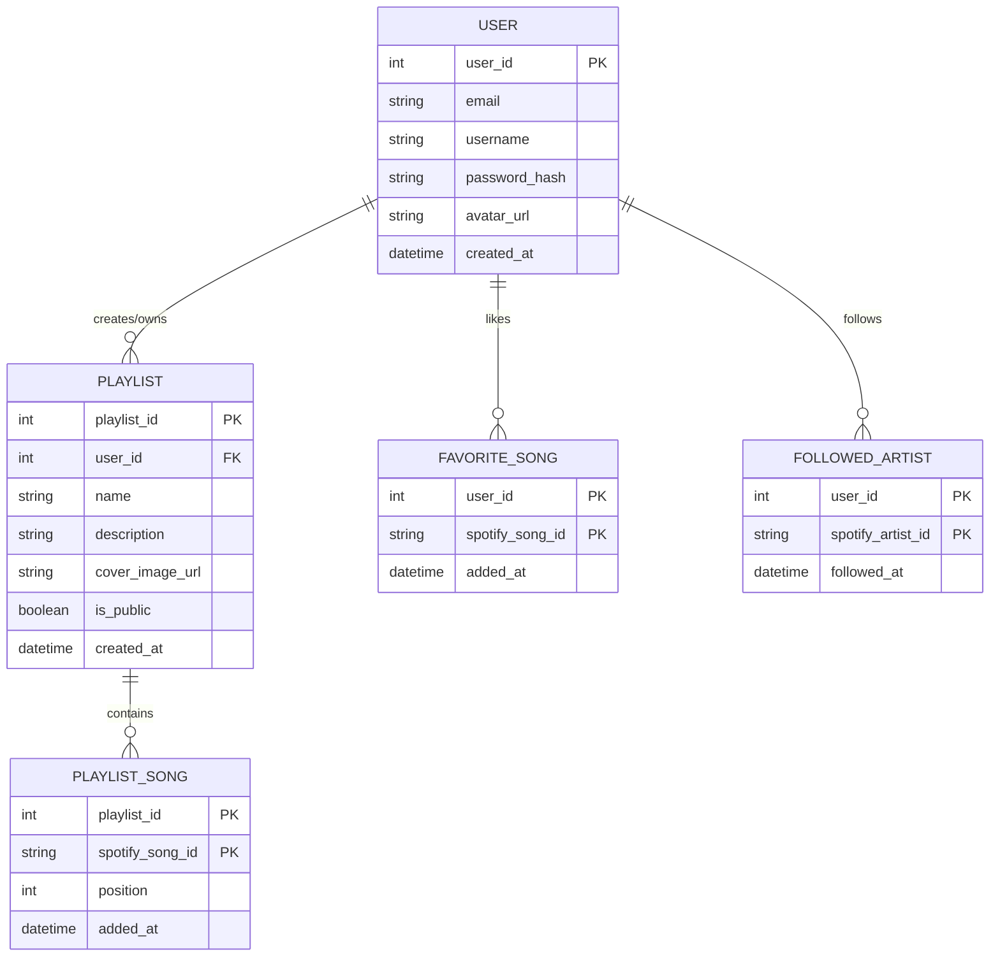

# Entity Relationship Diagram (ERD)

Sơ đồ ERD sử dụng Mermaid JS để biểu diễn các thực thể cần lưu trữ trên SQL Server.

*Lưu ý:* Các thực thể như Song, Album, Artist sẽ không được lưu trữ đầy đủ toàn bộ trong database nội bộ để tránh dư thừa. App chủ yếu lưu trữ `spotify_id` để tham chiếu dữ liệu từ Spotify API.
