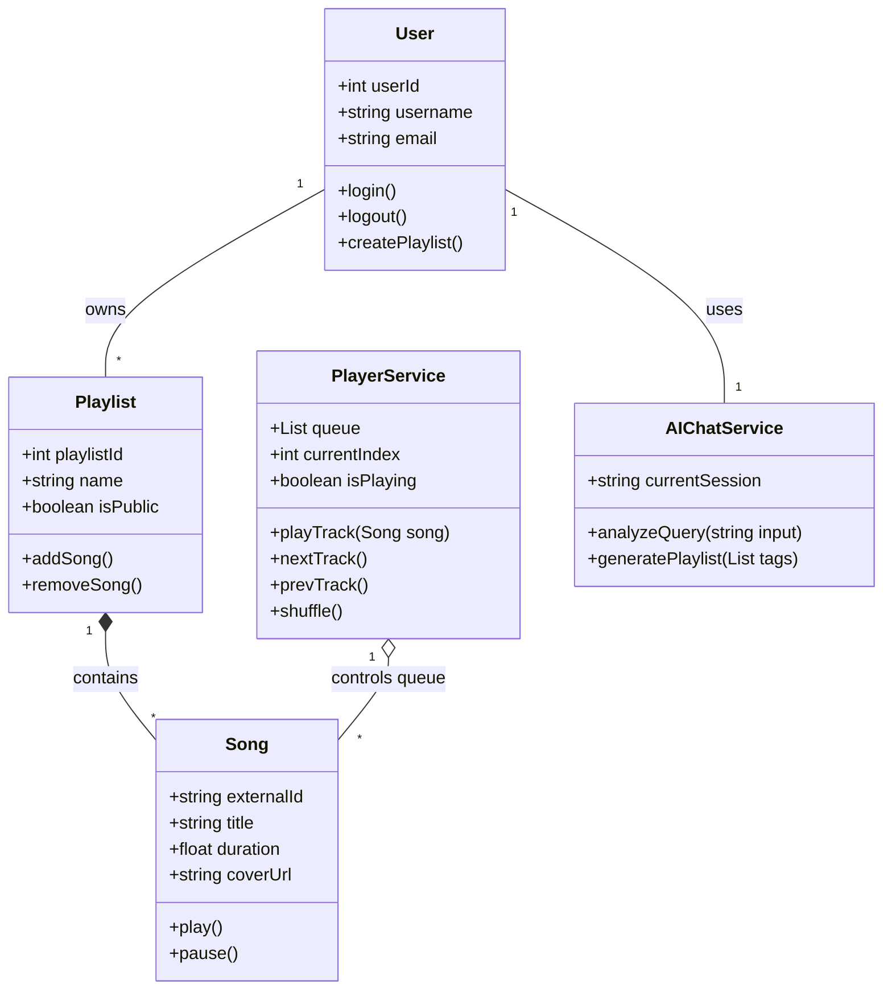

# UML Diagrams

## 1. Use Case Diagram
Biểu diễn các hành động chính mà người dùng có thể thực hiện trên hệ thống.

```mermaid
usecaseDiagram
actor "User" as user
actor "OpenAI/ChatGPT" as ai
actor "Spotify API" as spotify

rectangle "Hybrid Music App" {
  usecase "Đăng ký / Đăng nhập" as UC1
  usecase "Phát nhạc (Play/Pause/Next)" as UC2
  usecase "Quản lý Thư viện (Album/Nghệ sĩ)" as UC3
  usecase "Quản lý Playlist (Tạo/Sửa/Xóa)" as UC4
  usecase "Tìm kiếm bài hát / nghệ sĩ" as UC5
  usecase "Trò chuyện tìm nhạc với AI" as UC6
  usecase "Xem gợi ý âm nhạc (Discovery)" as UC7
}

user --> UC1
user --> UC2
user --> UC3
user --> UC4
user --> UC5
user --> UC6
user --> UC7

UC2 ..> spotify : "Fetch audio stream"
UC5 ..> spotify : "Fetch metadata"
UC7 ..> spotify : "Fetch recommendations"
UC6 ..> ai : "Phân tích NLP"
UC6 ..> spotify : "Match kết quả NLP với Spotify"
```

---

## 2. Activity Diagram: Luồng Tạo Playlist qua Chatbot AI
Mô tả quy trình nghiệp vụ khi người dùng yêu cầu AI tạo một playlist dựa trên cảm xúc hoặc các thẻ (tags).

```mermaid
flowchart TD
    Start((Bắt đầu)) --> A[Người dùng mở Chatbot AI]
    A --> B[Nhập yêu cầu: VD: Tạo một list nhạc lofi buồn]
    B --> C[Hệ thống gửi văn bản tới AI API]
    C --> D{AI có hiểu yêu cầu?}
    D -- Không --> E[Phản hồi yêu cầu nhập lại] --> B
    D -- Có --> F[AI trích xuất keywords, vibes, thể loại]
    F --> G[Hệ thống gọi API Tìm kiếm (Spotify/Stats.fm)]
    G --> H[Lấy danh sách Spotify IDs phù hợp]
    H --> I[Hiển thị danh sách đề xuất cho User]
    I --> J{User có muốn lưu Playlist không?}
    J -- Không --> K[Tiếp tục chat hoặc phát ngay]
    J -- Có --> L[Tạo Playlist mới trong Database]
    L --> M[Lưu mapping User_Playlist và Playlist_Song]
    M --> N[Thông báo tạo thành công]
    N --> End((Kết thúc))
```

---

## 3. Class Diagram 
Mô tả kiến trúc lớp hướng đối tượng của hệ thống phân phối nội dung và Player.


